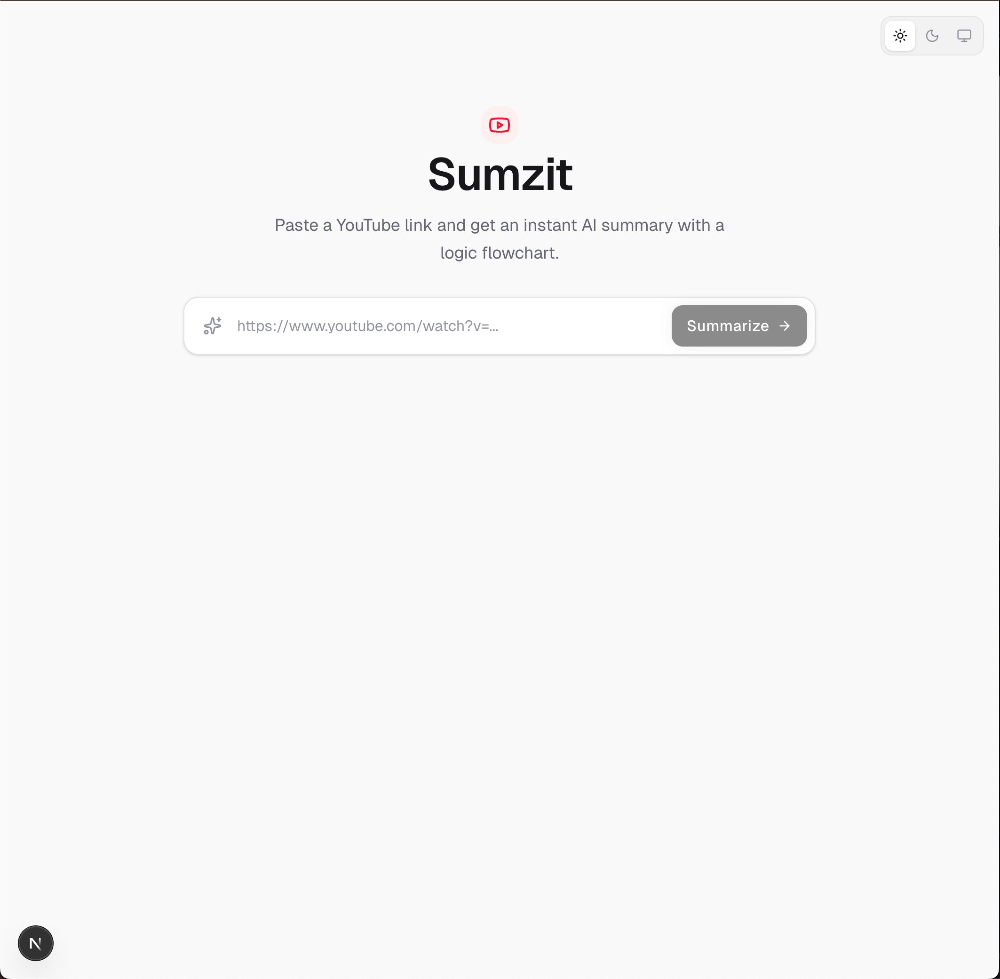

# Sumzit 🚀

> Extract structured summaries and visual flowcharts from any YouTube video instantly.

<br>

<div align="center">
 [](https://drive.google.com/file/d/1u91CvsSWJspS5rL7mI8Exx8Jv6JbTPhU/view?usp=sharing)
</div>

<br>

Sumzit is a fast, lightweight web application built for the **Accomplish AI x WeMakeDevs Hackathon**. It aims to solve the problem of limited time and long educational videos or podcasts by automating transcript fetching and generating comprehensive, structured markdown summaries along with tree-style Mermaid diagrams.

## ✨ Features

- **Custom Transcript Fetcher:** Bypasses normal npm library blocking (which fail on auto-generated captions) by using a reverse-engineered Android innertube player API to fetch ASR captions reliably.
- **Local AI Processing via LM Studio:** Fully private, local, and zero-cost inference using an OpenAI-compatible local server.
- **Fast Raw SSE Streaming:** AI responses stream token-by-token instantly. No bulky AI SDK wrappers.
- **Robust Mermaid Flowcharts:** Automatically maps out the flow or key logic of the video into a rich tree-like diagram. Includes a custom sanitizer to clean up common LLM syntax errors (e.g., duplicate qualifiers, bad brackets).
- **Download to Markdown:** Export your summaries and Mermaid charts directly to a `.md` file for your personal notes.
- **Light/Dark Mode:** Seamless theme switching for both the interface and the rendered Mermaid diagrams.
- **Dockerized & Optimized:** Multi-stage Docker build keeps the final image footprint tiny (~100MB). Uses `host.docker.internal` to talk smoothly to your local LM Studio instance.

## 🛠 Tech Stack

- **Framework:** Next.js 16 (App Router)
- **Library:** React 19, Framer Motion, Lucide React
- **Styling:** Tailwind CSS v4
- **Diagrams:** Mermaid.js
- **Runtime / Package Manager:** Bun
- **AI:** LM Studio

## 🚀 Getting Started

### Prerequisites

1. Install [Bun](https://bun.sh/).
2. Install [LM Studio](https://lmstudio.ai/).
3. Start LM Studio's Local Server on port `1234` (ensure it runs on `http://127.0.0.1:1234/v1` or update your `.env.local` to match). It is recommended to load an instruct model like `qwen2.5-coder-7b-instruct` or `llama-3`.

### Running Locally

```bash
# Clone the repository
git clone https://github.com/yourusername/sumzit.git
cd sumzit

# Install dependencies
bun install

# Start the development server
bun run dev
```

Open `http://localhost:3000` with your browser to see the result.

### Running via Docker

We've provided a highly optimized `Dockerfile` and `docker-compose.yaml` setup for secure, containerized deployments.

```bash
# Build the image and start the container
docker compose up --build
```

*(Note: The `docker-compose.yaml` file is pre-configured to reach LM Studio on your host machine through `host.docker.internal`.)*

## 💡 Why Sumzit?

The typical workflow today involves copying a video link, pasting it into a third-party transcript website, fighting with massive blocks of text, pasting them into ChatGPT, and hitting token limits. 

With Sumzit, it’s **one URL in, structured summary out**. It grabs the raw captions instantly, streams the summary to you in segments, builds a visualization of the content, and gives it to you in a downloadable Markdown file.

---

*Built with ❤️ for the Accomplish AI Hackathon.*
